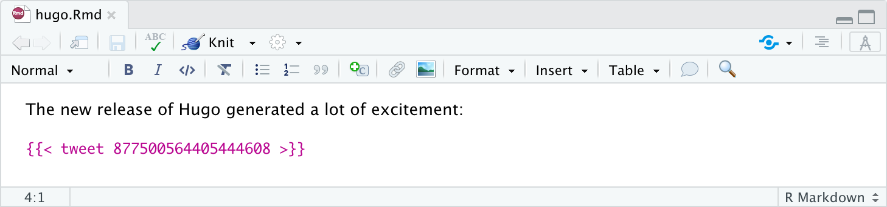
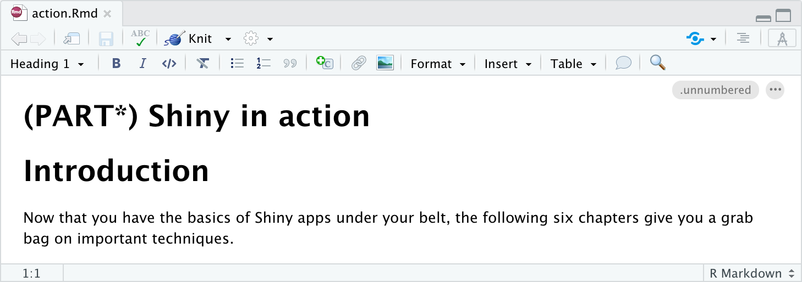
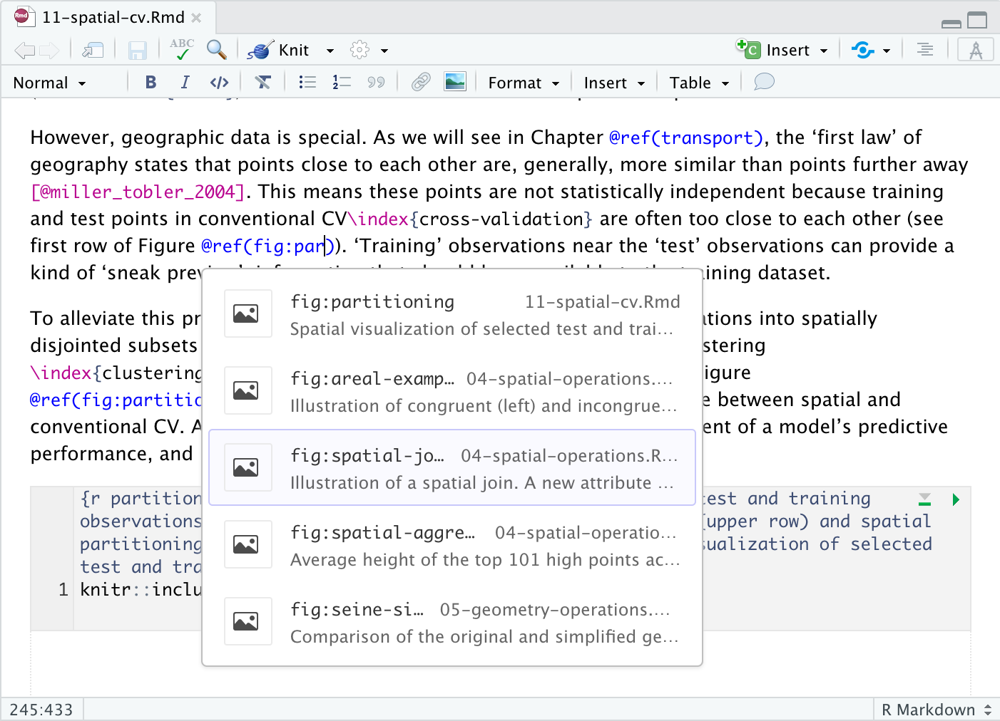

```{r setup, include=FALSE, echo = FALSE}
knitr::opts_chunk$set(echo = TRUE)
```

# Working with markdown-based packages

## Hugo {#hugo}

Hugo includes support for shortcodes, which are special macros generally used to render more complex objects (e.g. tweets or videos). You can include shortcodes in visual mode by just typing them with the normal Hugo syntax:



## Bookdown {#bookdown}

Visual mode supports cross-references and Part headers from the [`bookdown`](https://bookdown.org/ "bookdown") package. This helps you visually organize chapters and parts of your bookdown docs and cross-reference files more easily.

Bookdown recognizes level 1 headers written with a (PART) prefix as book sections. For example, the below markdown generates the headers and sections in the following image:

`# (PART\*) Shiny in action {.unnumbered}`

`## Introduction`



Cross-references enable you to easily link to figures, equations, and even arbitrary labels within a document. In Visual Markdown, you would write a cross-reference to a figure like this: `@ref(fig:label)` and the search across all cross-references in your project to easily find the right reference ID, as below:



## flexdashboard {#flexdashboard}

Dashboards created with [`flexdashboard`](https://rmarkdown.rstudio.com/flexdashboard/ "flexdashboard") can be edited in Visual mode.

The `flexdashboard` package uses R Markdown to create and edit interactive dashboards. This update is quite helpful for visualizing dashboard layouts and components.

You can then add tables and images as you would in Visual R Markdown.

##### -\> Quick demo of images in flexdashboard {#demo-of-images-in-flexdashboard}

## xaringan {.xaringan}

Maybe one day?
